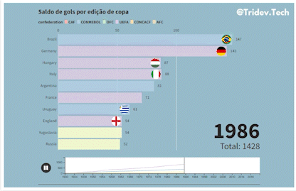

# Analise das Copas com Python

## Minhas redes sociais:

	<a  href="https://github.com/Hugox96/">
	

	

 ## :memo: Descrição e objetivo:
 
Neste projeto você irá encontrar três gráficos animados que nos dizem um pouco da história das copas do mundo ao longos dos anos. Meu objetivo com este projeto é aprimorar meus conhecimentos de análise de dados com python utilizando a biblioteca pandas unindo com meu amor pelo futebol e com a intenção de criar algo criativo e informativo.

## 💻 Sobre o projeto

O processo de análise foi baseado em 3 principios:

* 1º Obtenção dos dados
* 2º Filtragem dos dados e criação dos dataframes
* 3º Criação dos gráficos animados

O dados com a base de dados da copa foram obtidos no site Kaggle: https://www.kaggle.com/datasets/abecklas/fifa-world-cup

Os gráficos animados foram criados pelo site Flourish: https://app.flourish.studio/projects

O projeto foi inspirado no seguinte tutorial: https://www.youtube.com/watch?v=pa21vUQuaG8&t=2s

## :wrench: Tecnologias utilizadas
* Google Collab;
* Python & Pandas;
* Visual Studio Code; 	
* Excel 	
	
## :ballot_box_with_check: Gráficos

  

	

 O site está disponível por este link: https://hugox96.github.io/Endeavor-Portfolio/

